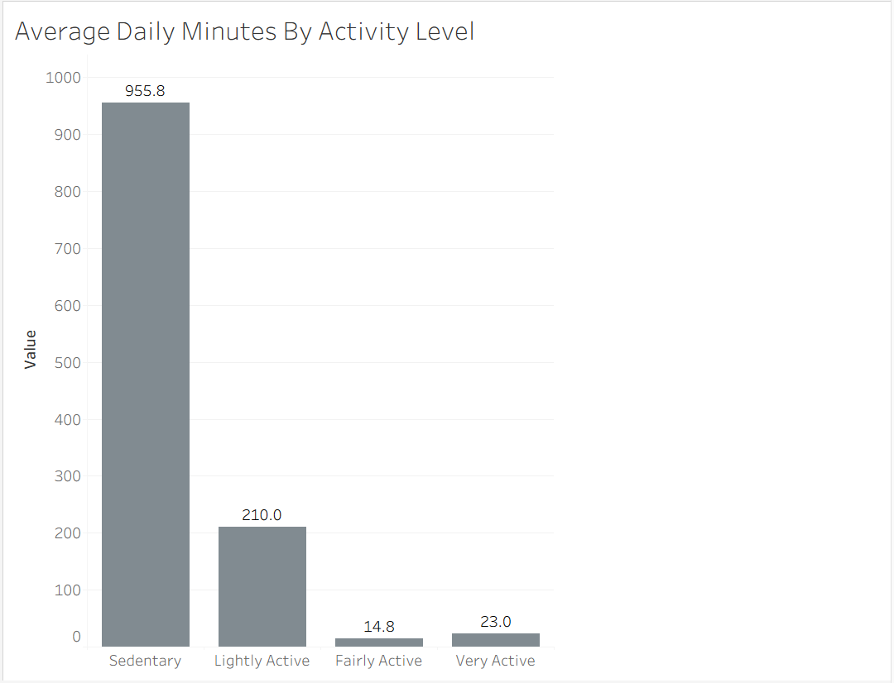
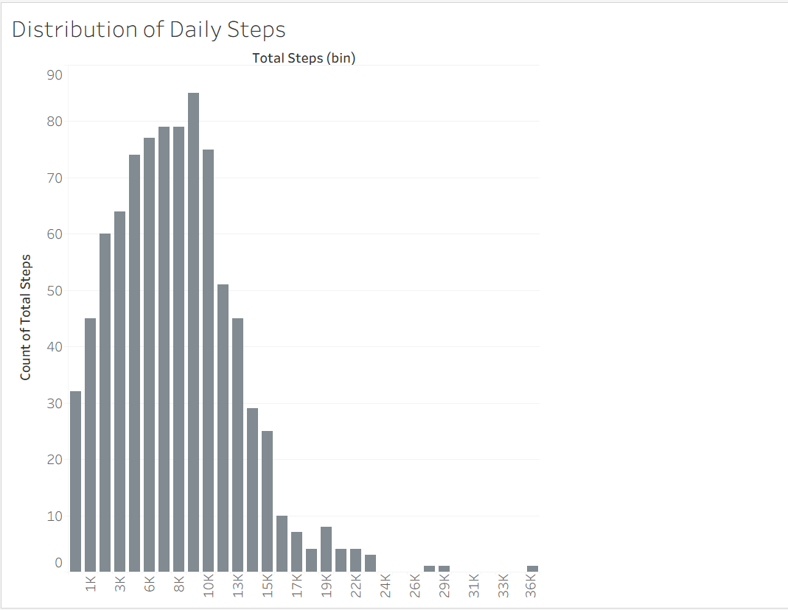
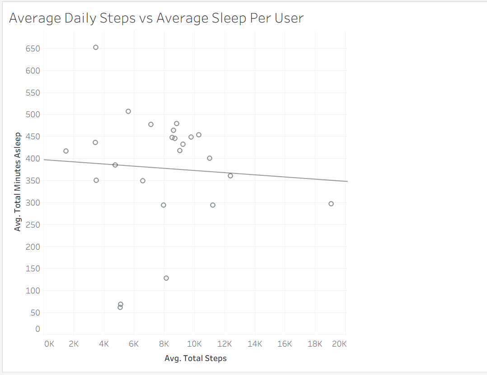

# Bellabeat Case Study: How Smart Device Data Can Shape Marketing Strategy

## Overview
This case study looks at smart device usage data to find insights that could 
shape marketing strategy for Bellabeat, a wellness technology company. Using 
the FitBit Fitness Tracker dataset, I worked through the full data analysis 
process that is, Ask, Prepare, Process, Analyze, Share, and Act.

Bellabeat wants to understand how people use smart devices in general, then 
apply what's learned to one of its own products, the Leaf tracker.

## Business Task
Bellabeat is a wellness technology company who wants a better understanding of how consumers use non-Bellabeat devices in their daily lives. These insights will be then used to help identify the trends that can inform Bellabeat's marketing strategy for one of its products

Full details: [docs/business_task.md](docs/business_task.md)

## Data Source
FitBit Fitness Tracker Data whihc is made available on Kaggle through Mobius.
License: CC0: Public Domain.
Few Limitations:
- Small, non-representative sample size, only 30 users
- Self-reported data may contain gaps or inaccuracies

Full details: [docs/data_sources.md](docs/data_sources.md)

## Cleaning & Preparation
Both files were checked for duplicates, nulls, and wrong values. `sleep_day` 
had 3 exact duplicate rows, which were removed. A date-format mismatch between 
the two tables initially caused a failed join, which was fixed by extracting a 
clean date column from `sleep_day`. 73 rows in `daily_activity` showed 0 steps 
with logged calories (likely non-wear days) and were excluded from step-based 
analysis. All cleaning was done in SQLite, full details in the cleaning log.

Full details: [docs/cleaning_log.md](docs/cleaning_log.md)

## Analysis & Findings

### 1. Sedentary time dominates the day

On average, users spend about 956 minutes (nearly 16 hours) a day sedentary, compared to just 38 minutes combined in fairly and very active states, suggesting Bellabeat's Leaf could focus on frequent movement nudges rather than intense workout tracking.

### 2. Most users fall just short of 10,000 steps

Daily step counts cluster mostly between 4,000 and 13,000, with an average of 8,319 steps, just short of the commonly cited 10,000-step benchmark.

### 3. No clear link between activity and sleep

There is no clear relationship between how many steps a user takes and how much they sleep, indicating that Bellabeat's activity and sleep features may need to be marketed as addressing separate, independent user needs.

## Recommendations

1. Stop chasing workouts, start interrupting sitting.
The data made this pretty obvious that users are sedentary for almost 16 hours a day, and barely scrape together 40 minutes of real activity. That's not a "people need to exercise more" problem, it's a "people are stuck at a desk all day" problem. Leaf doesn't need to compete on workout tracking. It should just nudge people to get up every hour or so, a short buzz, a quick "you've been still for a while", because that's the behavior that's actually broken.

2. Make the step goal feel closer than it is.
People are averaging around 8,300 steps a day, which is honestly not far off from 10,000 they're closer than they probably think. Instead of showing users a big scary "you're behind" number, Leaf could reframe it to "just 1,700 more steps to hit your goal today." Same data, but it stops feeling like failure and starts feeling doable.

3. Help people actually fall asleep, not just track that they didn't.
Users are lying in bed for almost 40 minutes before they're actually asleep. That's a real, specific problem Leaf could solve, not with another chart, but with something in the moment, a wind-down mode, maybe a gentle vibration reminding someone to put their phone down, or a short breathing exercise built into the app. Right now Leaf just tells people they're not sleeping well. It should help fix that.

## Tools Used
SQL (SQLite), Python (pandas), Tableau
